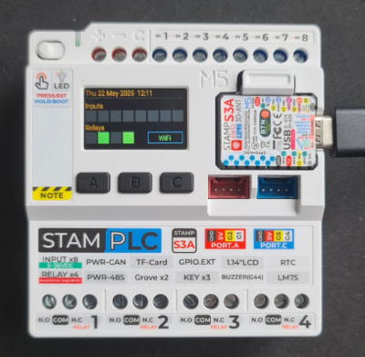

# esphome-m5stamplc
ESPHome configuration &amp; components for the M5StamPLC controller.

If you find this useful please consider supporting me by buying me a coffee. Thank you!

[](https://www.buymeacoffee.com/jvn5gy8fdy)

https://docs.m5stack.com/en/core/StamPLC



The example config requires wifi to be configured. The LED screen displays relay and input status along with date/time and wifi connection status. If the Home Assistant API is enabled then all the relays, inputs, buttons and LED indicator controls show up in the Home Assistant UI.

The LED indicator light can show a maximum of 8 colours using a combination of 3 RGB switches.

The configuration also reports controller temperature, voltage, current, and power. Since the configuration is using Wifi and SNTP, the internal RTC is not currently used. Submit an issue if you would like support for the RTC chip.

In time, these components will be submitted to ESPHome to be included as standard components.

Please post your example configs in the discussion area - especially any LVGL/Display configurations.

TODO: One single M5StamPLC component to abstract away some of the configuration complexities and to bring all the dependencies together.

NB: The controller uses GPIO03 drain pin as RESET. It needs to be pulled HIGH during boot for the GPIO Expander to initialise correctly:

```yaml
  on_boot:
    - priority: 1000
      then:
        - lambda: |-
            pinMode(03, OUTPUT);
            digitalWrite(03, HIGH);
```


Example Configuration YAML:
```yaml
substitutions:
  name: m5stamplc
  friendly_name: 'M5Stack STAMPLC'

esphome:
  name: ${name}
  friendly_name: ${friendly_name}
  platformio_options:
    build_flags:
      - -DESP32S3
      - -DCORE_DEBUG_LEVEL=5
      - -DARDUINO_USB_CDC_ON_BOOT=1
      - -DARDUINO_USB_MODE=1
  on_boot:
    - priority: 1000
      then:
        - lambda: |-
            pinMode(03, OUTPUT);
            digitalWrite(03, HIGH);
    - priority: -100
      then:
       component.update: vdu

# Import custom components...
external_components:
    - source: github://beormund/esphome-m5stamplc@main
      components: [aw9523, pi4ioe5v6408, lm75b]

esp32:
  board: esp32-s3-devkitc-1
  flash_size: 8MB
  variant: ESP32S3
  framework:
    type: arduino

# I found OTA updating failed unless safe_mode was disabled
safe_mode:
  disabled: true

# Allow Over-The-Air updates
ota:
  - platform: esphome

#Enable logging
logger:

# Enable Home Assistant API
api:

# Allow provisioning Wi-Fi via serial
improv_serial:

wifi:
  id: wifi_1
  ssid: <your wifi ssid>
  password: <your wifi password>
  # Set up a wifi access point
  ap: {}
  on_connect:
    then:
      component.update: vdu
  on_disconnect:
    then:
      component.update: vdu

# In combination with the `ap` this allows the user
# to provision wifi credentials to the device via WiFi AP.
captive_portal:

# To have a "next url" for improv serial
web_server:
  port: 80

# Time
time:
  - platform: sntp
    id: sntp_time
    timezone: Europe/London
    on_time:
      - cron: '0 * * * * *'
        then:
          - component.update: vdu

i2c:
  sda: GPIO13
  scl: GPIO15
  scan: true

spi:
  clk_pin: GPIO7
  mosi_pin: GPIO8
  miso_pin: GPIO9

# RS485 pin config
uart:
  tx_pin: GPIO0
  rx_pin: GPIO39
  baud_rate: 9600
  parity: EVEN

# Configuration of i2c GPIO Expander 1 
pi4ioe5v6408:
  - id: pi4ioe5v6408_1
    address: 0x43

# Configuration of i2c GPIO Expander 2
aw9523:
  - id: aw9523_1
    address: 0x59
    divider: 3
    latch_inputs: true

# Relays 1-4
switch:
  - platform: gpio
    restore_mode: RESTORE_DEFAULT_OFF
    name: "Relay 1"
    id: r1
    pin:
      aw9523: aw9523_1
      number: 0
      mode:
        output: true
    on_turn_on:
      - component.update: vdu
    on_turn_off:
      - component.update: vdu
  - platform: gpio
    restore_mode: RESTORE_DEFAULT_OFF
    name: "Relay 2"
    id: r2
    pin:
      aw9523: aw9523_1
      number: 1
      mode:
        output: true
    on_turn_on:
      - component.update: vdu
    on_turn_off:
      - component.update: vdu
  - platform: gpio
    restore_mode: RESTORE_DEFAULT_OFF
    name: "Relay 3"
    id: r3
    pin:
      aw9523: aw9523_1
      number: 2
      mode:
        output: true
    on_turn_on:
      - component.update: vdu
    on_turn_off:
      - component.update: vdu
  - platform: gpio
    restore_mode: RESTORE_DEFAULT_OFF
    name: "Relay 4"
    id: r4
    pin:
      aw9523: aw9523_1
      number: 3
      mode:
        output: true
    on_turn_on:
      - component.update: vdu
    on_turn_off:
      - component.update: vdu
  # LED backlight (on/off only)
  - platform: gpio
    restore_mode: ALWAYS_ON
    name: "LED Backlight"
    pin:
      pi4ioe5v6408: pi4ioe5v6408_1
      number: 7
      inverted: true
      mode:
        output: true
        pulldown: true
  # LED (8 colors using RGB on/off)        
  - platform: gpio
    restore_mode: RESTORE_DEFAULT_ON
    name: "LED Red"
    pin:
      pi4ioe5v6408: pi4ioe5v6408_1
      number: 6
      inverted: true
      mode:
        output: true
        pulldown: true
  - platform: gpio
    restore_mode: RESTORE_DEFAULT_ON
    name: "LED Green"
    pin:
      pi4ioe5v6408: pi4ioe5v6408_1
      number: 5
      inverted: true
      mode:
        output: true
        pulldown: true
  - platform: gpio
    restore_mode: RESTORE_DEFAULT_ON
    name: "LED Blue"
    pin:
      pi4ioe5v6408: pi4ioe5v6408_1
      number: 4
      inverted: true
      mode:
        output: true
        pulldown: true

# Set up the pwm buzzer on pin 44
# See https://esphome.io/components/rtttl.html
output:
  - platform: ledc
    pin: GPIO44
    id: buzzer

rtttl:
  output: buzzer
  id: buzzer_1

# Inputs 1-8
binary_sensor:
  - platform: gpio
    id: i1
    name: "Input 1"
    pin:
      aw9523: aw9523_1
      number: 4
      mode:
        input: true
    on_state:
      then:
        - component.update: vdu
  - platform: gpio
    id: i2
    name: "Input 2"
    pin:
      aw9523: aw9523_1
      number: 5
      mode:
        input: true
    on_state:
      then:
        - component.update: vdu
  - platform: gpio
    id: i3
    name: "Input 3"
    pin:
      aw9523: aw9523_1
      number: 6
      mode:
        input: true
    on_state:
      then:
        - component.update: vdu
  - platform: gpio
    id: i4
    name: "Input 4"
    pin:
      aw9523: aw9523_1
      number: 7
      mode:
        input: true
    on_state:
      then:
        - component.update: vdu
  - platform: gpio
    id: i5
    name: "Input 5"
    pin:
      aw9523: aw9523_1
      number: 12
      mode:
        input: true
    on_state:
      then:
        - component.update: vdu
  - platform: gpio
    id: i6
    name: "Input 6"
    pin:
      aw9523: aw9523_1
      number: 13
      mode:
        input: true
    on_state:
      then:
        - component.update: vdu
  - platform: gpio
    id: i7
    name: "Input 7"
    pin:
      aw9523: aw9523_1
      number: 14
      mode:
        input: true
    on_state:
      then:
        - component.update: vdu
  - platform: gpio
    id: i8
    name: "Input 8"
    pin:
      aw9523: aw9523_1
      number: 15
      mode:
        input: true
    on_state:
      then:
        - component.update: vdu
  # Buttons 1-3
  - platform: gpio
    name: "Button A"
    pin:
      pi4ioe5v6408: pi4ioe5v6408_1
      number: 2
      inverted: true
      mode:
        input: true
        pullup: true
    on_press:
      - rtttl.play: "two_short:d=4,o=5,b=100:16e6,16e6"
  - platform: gpio
    name: "Button B"
    pin:
      pi4ioe5v6408: pi4ioe5v6408_1
      number: 1
      inverted: true
      mode:
        input: true
        pullup: true
    on_press:
      - rtttl.play: "two_short:d=4,o=5,b=100:16e6,16e6"
  - platform: gpio
    name: "Button C"
    pin:    
      pi4ioe5v6408: pi4ioe5v6408_1
      number: 0
      inverted: true
      mode:
        input: true
        pullup: true
    on_press:
      - rtttl.play: "two_short:d=4,o=5,b=100:16e6,16e6"

sensor:
  # INA226 Voltage/Current Sensor on i2c default Address 0x40
  - platform: ina226
    shunt_resistance: 0.01
    max_current: 8.192
    current:
      name: "Current"
    power:
      name: "Power"
    bus_voltage:
      name: "Bus Voltage"
    shunt_voltage:
      name: "Shunt Voltage"
  # LM75B Temp Sensor on i2c default address 0x48 
  - platform: lm75b
    name: "Temperature"
    update_interval: 60s

# Some colors for the LED display
color:
  - id: orange
    hex: FFA500
  - id: grey
    hex: 3A3B3C
  - id: blue
    hex: 6AC9FF
  - id: green
    hex: 2DDE68
  - id: red
    hex: F7444E

display:
  platform: ili9xxx
  id: vdu
  model: ST7789V
  rotation: 90
  dimensions:
    height: 240
    width: 135
    offset_height: 40
    offset_width: 52
  dc_pin: GPIO06
  cs_pin: GPIO12
  invert_colors: true
  update_interval: never
  #show_test_card: true
  lambda: |-
    if (id(sntp_time).now().is_valid()) {
      it.strftime(5, 0, id(font1), Color(orange), "%a %d %b %Y  %H:%M", id(sntp_time).now()); 
    }
    it.line(5, 19, 230, 19, id(grey));
    it.print(5, 28, id(font1), id(orange), "Inputs");
    it.filled_rectangle(5, 47, 25, 25, id(i1).state ? id(green) : id(grey));
    it.filled_rectangle(34, 47, 25, 25, id(i2).state ? id(green) : id(grey));
    it.filled_rectangle(63, 47, 25, 25, id(i3).state ? id(green) : id(grey));
    it.filled_rectangle(92, 47, 25, 25, id(i4).state ? id(green) : id(grey));
    it.filled_rectangle(121, 47, 25, 25, id(i5).state ? id(green) : id(grey));
    it.filled_rectangle(150, 47, 25, 25, id(i6).state ? id(green) : id(grey));
    it.filled_rectangle(179, 47, 25, 25, id(i7).state ? id(green) : id(grey));
    it.filled_rectangle(208, 47, 25, 25, id(i8).state ? id(green) : id(grey));
    it.print(5, 76, id(font1), Color(orange), "Relays");
    it.filled_rectangle(5, 95, 25, 25, id(r1).state ? id(green) : id(grey));
    it.filled_rectangle(34, 95, 25, 25, id(r2).state ? id(green) : id(grey));
    it.filled_rectangle(63, 95, 25, 25, id(r3).state ? id(green) : id(grey));
    it.filled_rectangle(92, 95, 25, 25, id(r4).state ? id(green) : id(grey));
    it.rectangle(150, 95, 81, 25, id(blue));
    it.print(175, 100, id(font1), id(wifi_1).is_connected() ? id(green) : id(grey), "WiFi");
font:
  file: "gfonts://Roboto"
  id: font1
  size: 15
```
